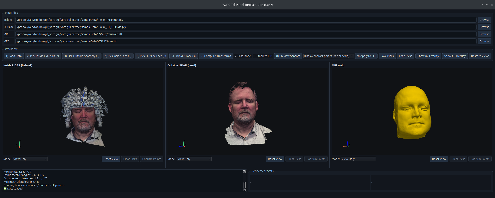

# YORC Tripanel GUI

Manual and semi-automatic OPM-MEG to MRI coregistration GUI with three synchronized 3D panels:

1. Inside LIDAR (helmet)
2. Outside LIDAR (head)
3. MRI scalp



This is a focused extraction of the tripanel GUI from the main YORC repository. It does not link back to `YORC.py` — changes to the parent repo must be ported manually. There is no automatic pipeline mode; all steps require manual interaction.

For full setup and usage instructions see [USER_GUIDE.md](USER_GUIDE.md).

## Requirements

- Python 3.11+
- [`uv`](https://docs.astral.sh/uv/getting-started/) (recommended) or `pip`

## Quick Start

With `uv` (recommended):

```bash
uv sync
uv run yorc-tripanel-gui
```

With `pip`:

```bash
python3 -m venv .venv
source .venv/bin/activate
pip install -e .
yorc-tripanel-gui
```

## Sample Data

Sample data is hosted on OSF. To download it:

```bash
./download_sample_data.sh
```

Then launch the GUI with the sample files pre-loaded:

```bash
./launch_sample.sh
```

## Project Layout

- `scripts/tripanel_registration_gui.py` — entry point
- `yorc/gui/tripanel_registration_window.py` — main window
- `yorc/gui/viewer_3d.py` / `viewer_3d_native.py` — 3D panels
- `yorc/core/registration.py` — registration pipeline
- `yorc/core/io_utils.py` — file loading
- `yorc/core/fiducial_estimation.py` / `landmark_detection.py` — landmark tools

## What This Extract Includes

- Tripanel launcher and UI logic
- Automatic helmet fiducial detection from red/green sticker markers
- Core registration pipeline
- Supporting utilities required at runtime
- BIDS fiducial export to MEG FIF metadata and T1 JSON sidecars
- Sample data download and launch scripts
- HTML user docs and image assets

## What This Extract Does Not Include

- Legacy monolithic script workflows (`YORC.py`)
- Archived experimental GUI branches

## Troubleshooting

- If the GUI does not appear, keep the terminal open and inspect startup output.
- On Linux/headless environments, ensure a display server is available.
- If OpenGL issues occur, try `--renderer native-vtk` or `--renderer pyvista`.
- See [USER_GUIDE.md](USER_GUIDE.md) for further troubleshooting.

## Authors

Developed at York Neuroimaging Centre, University of York.
The original code was developed by Richard Aveyard and Joe Lyons. 

This version (with a focus on the tripanel GUI) was extracted and is maintained by Alex Wade — University of York (alex.wade@york.ac.uk)

With significant AI help!

## License

Copyright (c) The University of York. All rights reserved.

Redistribution and use in source and binary forms, with or without modification, are permitted provided that the following conditions are met:

Redistributions of source code must retain the above copyright notice, this list of conditions and the following disclaimer.
Redistributions in binary form must reproduce the above copyright notice, this list of conditions and the following disclaimer in the documentation and/or other materials provided with the distribution.
Neither the name of the University nor the names of its contributors may be used to endorse or promote products derived from this software without specific prior written permission.
THIS SOFTWARE IS PROVIDED BY THE UNIVERSITY AND CONTRIBUTORS ``AS IS'' AND ANY EXPRESS OR IMPLIED WARRANTIES, INCLUDING, BUT NOT LIMITED TO, THE IMPLIED WARRANTIES OF MERCHANTABILITY AND FITNESS FOR A PARTICULAR PURPOSE ARE DISCLAIMED. IN NO EVENT SHALL THE UNIVERSITY OR CONTRIBUTORS BE LIABLE FOR ANY DIRECT, INDIRECT, INCIDENTAL, SPECIAL, EXEMPLARY, OR CONSEQUENTIAL DAMAGES (INCLUDING, BUT NOT LIMITED TO, PROCUREMENT OF SUBSTITUTE GOODS OR SERVICES; LOSS OF USE, DATA, OR PROFITS; OR BUSINESS INTERRUPTION) HOWEVER CAUSED AND ON ANY THEORY OF LIABILITY, WHETHER IN CONTRACT, STRICT LIABILITY, OR TORT (INCLUDING NEGLIGENCE OR OTHERWISE) ARISING IN ANY WAY OUT OF THE USE OF THIS SOFTWARE, EVEN IF ADVISED OF THE POSSIBILITY OF SUCH DAMAGE.
